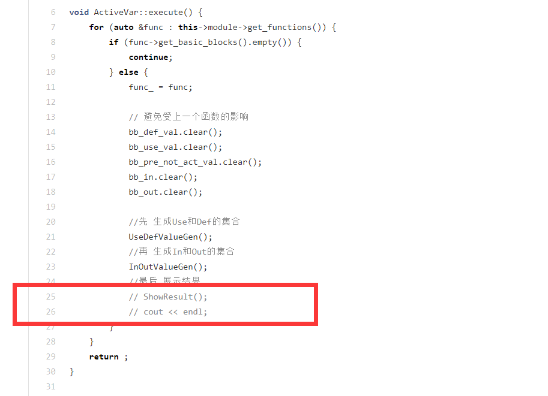

# 说明

**下面对本文件夹中的文件进行说明**

av_simple.sy是一个较简单的测试活跃变量的样例。
av_simple.txt是每个块所对应的活跃变量。
av_s.ll是仅用"-O"和"-av"生成的中间代码。

av_hard.sy是一个较复杂的测试活跃变量的样例。
av_hard.txt是每个块入口出口处的活跃变量以及use，def和后继块的标签。
av_h.ll是仅用"-O"和"-av"生成的中间代码。

通过人工验证知，生成的活跃变量是准确的。

**！！！注意！！！**

**提交的代码中默认注释了直接在控制台打印活跃变量的函数，如果希望直观的看到活跃变量，请将如下注释删除！！！**

