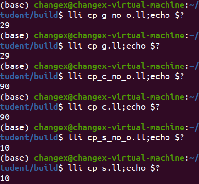

# 说明

**下面对本文件夹中的文件进行说明**

cp_simple.sy是一个简单的测试常量传播的样例。
cp_s.ll是使用-cp选项后生成的中间代码。
cp_s_no_o.ll是不使用-cp选项生成的中间代码。

cp_cond.sy是测试条件分支的常量传播的样例。
cp_c.ll是使用-cp选项后生成的中间代码。
cp_c_no_o.ll是不使用-cp选项生成的中间代码。

cp_global.sy是基本块内全局变量的常量传播的样例。
cp_g.ll是使用-cp选项后生成的中间代码。
cp_g_no_o.ll是不使用-cp选项生成的中间代码。

功能测试情况如下所示：

可以看到，优化前后结果是一致的。