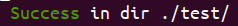
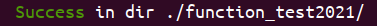
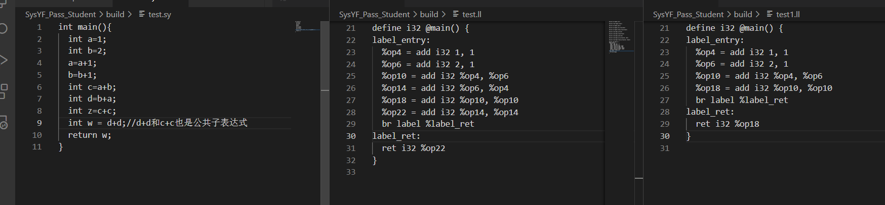
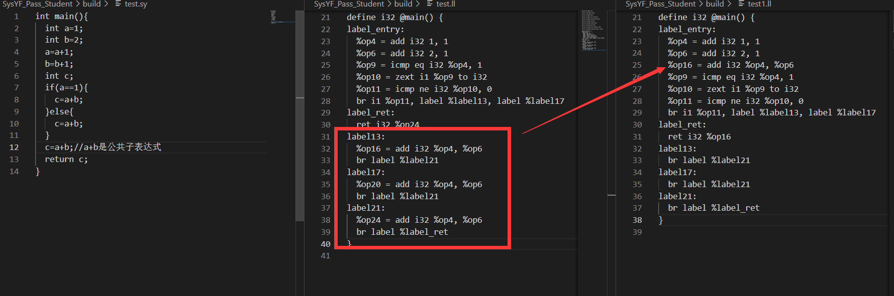
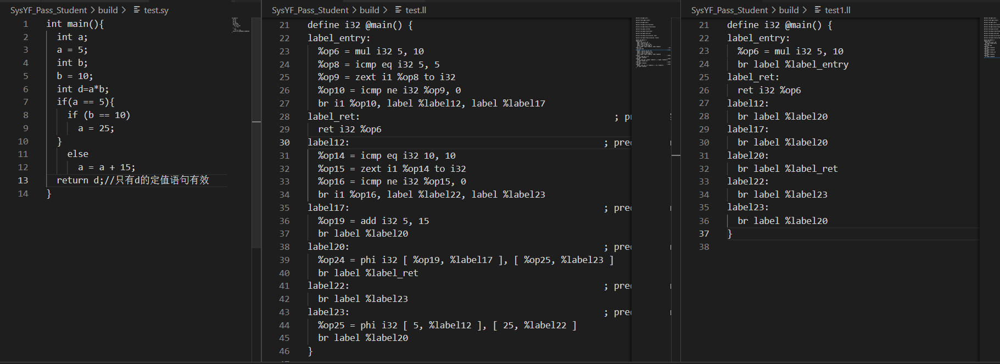

# 编译原理H · PW7

## 一、小组成员及分工

​		本小组所做选做为选做一，考虑到选做一相较于其他选做或许任务量相对较少，且为了方便任务的分配，我们完成了选做一中的全部三种优化任务。下面给出任务分工及贡献度：

| 姓名   | 必做任务     | 选做任务       | 总贡献度 |
| ------ | ------------ | -------------- | -------- |
| 彭怡腾 | 活跃变量分析 | 常量传播       | 33%      |
| 朱一鸣 | 公共子表达式 | 死代码删除     | 33%      |
| 陈思睿 | 支配树       | 循环不变式外提 | 33%      |

## 二、功能测试情况

​		为了确保我们的代码没有进行过于激进的优化而导致大量程序优化后的不可用，我们利用2021编译能力大赛所提供的测试集([function_test2020&function_test2021](https://gitlab.eduxiji.net/nscscc/compiler2021/-/tree/master/公开用例与运行时库))和助教在pw6中提供的测试集和py代码对优化后的代码进行了测试。

​		我们首先从中剔除了-O选项下也无法正确运行的代码，并对剩余的测试样例分别进行了"-cp"，"-cse"，"-dce"，"-lih"，"-av"以及"-O2"选项下的功能测试。经过反复调试后，使得我们的优化能够保证优化前后结果的一致性，正确通过了全部的测试样例。如下图所示：






​		所使用的功能测试样例均在 **SysYF_Pass_Student**目录下的func_test文件夹中。（注：2021年功能测试的第107个点需要等待较长时间，但可以顺利通过）

​		下面部分所使用的展示优化的样例，以及其他的一些展示优化的样例均在 **SysYF_Pass_Student**目录下的optimize_test文件夹中。

## 三、必做部分报告

### 1、必做-Part1：公共子表达式

#### B1-1.请说明你实现的公共子表达式删除算法的设计思路

1. 注意到`SSA`形式的代码中，每个基本块的$BB_{kill}$都为空集，所以直接根据
   $$
   OUT[BB] = IN[BB]\bigcup GEN[BB]\\
   IN[BB] = \bigcap_{BB'是BB的前驱}OUT[BB]
   $$
   可以计算每个块输入处的可用子表达式。

2. 对每个块中的语句进行判断：其计算是否是可用子表达式，如果是，则直接用可用子表达式替代改语句的使用者列表中所有语句的对应操作数，并将该语句删除；如果不是可用子表达式，则将其加入到可用子表达式列表之中；

3. 对于这样的情况：$In[BB]$的某条可用子表达式$inst$来自其不同前驱的计算（意味着子表达式的标号在不同前驱中不同）。我们通过$IN[BB]$中不在$OUT[BB\_dom]$中的表达式（$BB\_dom$是$BB$最近的支配节点），我们任意选择一个前驱中的子表达式，将其从现有的基本块中删除，并且添加到$BB$的支配结点$BB\_dom$之中（因为它可以由$BB$所有的前驱块计算，所以它的操作数一定在$BB\_dom$末尾之前得到了定义）。同时还要考虑到$BB\_dom$中最后一个语句是br，所以我们插入到倒数第二个位置。完成这个操作之后需要重新对每个块进行$IN[BB],OUT[BB],GEN[BB]$的计算。

4. 以上步骤可以完成公共子表达式的删除，但对于类似

   ```cpp
   int a=1;
   int b=1;
   int c=a+b;
   int d=a+b;
   int z=c+c;
   int w=d+d;//w可以直接使用z的结果
   ```

   代码中`d+d`与`c+c`这样的公共子表达式无法识别。所以我们每次执行1，2，3中描述的步骤，记录删去的使用公共子表达式的语句数量，若此次迭代有语句被删除，则在进行一次迭代，直到没有语句被删除为止。如此，我们便删去了所有的公共子表达式。

#### 测试样例

第一个测试样例是说明改优化可以找到多层的公共子表达：



第二个测试样例用来展示需要外提的公共子表达式：



#### B1-2若要将call指令、load指令列入公共子表达式删除的考虑范围，除了你实现的公共子表 达式删除算法，还需要考虑哪些其他因素？

对于call指令，需要考虑调用的函数会不会改变程序其他变量的值以及call中有没有打印、接受输入这样的函数。

对于load指令，需要考虑被load的值有没有被更改过。

### 2、 必做-Part2：活跃变量分析

#### **B2-1**. 请说明你实现的活跃变量分析算法的设计思路。

​		按照我们实现的流程，我们先介绍基础的活跃变量分析，即不考虑phi指令时的活跃变量分析算法和实现，然后在此基础上，我们介绍考虑SSA的phi指令时修改后的活跃变量分析算法及其实现。

**不考虑phi的基础活跃变量分析**

​		不考虑phi指令时的活跃变量分析较为简单，按照书本算法即可：

```
use_B：块中有引用且在引用前无定值的变量集
def_B：块中有定值的变量集
IN[B] = use_B ∪ (OUT[B] - def_B)
OUT[B] = ∪IN[S] (S是B的后继)
```

然后一直迭代到IN和OUT收敛即可。在具体实现时，由于我们是基于SSA形式的中间代码进行的优化，因此可以确保不会出现形如`i = i + 1`这种形式的代码，即对于一个变量的定值和引用不会出现在同一个语句中，且对于SSA来说，每一次被赋值的变量均不相同，因此我们绝不会看到一个变量的引用在定值之前。

​		于是基于以上认识，在实现的时候我们可以首先遍历整个块，获取定值的变量集合，然后再次遍历这个块，获取引用的变量集合，如果某一变量也出现在了定值集合中，则不将其加入引用集合。

​		拥有每个块的use集合和def集合后，我们便可以计算每个块的IN和OUT集合。首先计算OUT集合，将它的后继的IN集合全部利用set类的union方法求并集即可。然后通过已有的OUT，use，def，我们计算每个块的IN集合，使用set类的union方法可求并集，使用set_difference方法可求差集。然后我们将得到的新的IN集合和原来的IN集合做对比（两者求并集后和原来的IN集合比较元素个数），如果发生了变化，就代表还没收敛，于是进行下一次的IN集合和OUT集合的计算，直到所有的IN集合都不再变化。

​		此时得到的IN集合和OUT集合即是每个块入口和出口处的活跃变量集合。最后通过每个块的`set_live_in`和`set_live_out`方法分别设置它们的IN集合和OUT集合即可。

**在基础活跃变量分析的基础上引入phi的考虑**：

​		下面我们开始考虑phi指令，加入phi指令后，活跃变量将发生如下变化：例如对bb3块中的语句：`%0 = phi [%op1, %bb1], [%op2, %bb2]`来说，如果它在别处没有用到op1，op2，且在此块之后的任何代码都没有用到op1，op2。那么对于bb1来说，它不应该看到op2的活跃性，而对bb2来说，它不应该看到op1的活跃性。

​		因此我们所做的修改应该是当OUT[B]汇聚它后继的IN时，不考虑仅由该块其他前驱引起的活跃变量，即前文的OUT的汇聚算法将变为

```
OUT[B] = ∪(IN[S] / {S中仅由非B前驱而导致活跃的变量}) (S是B的后继)
```

​		基于此改动，我们对原来的实现过程做出如下改动：首先，我们在建立每个块的use集合时同时还建立not_phi_but_use_set（除phi以外的指令引用变量集合）以及bb_pre_not_act_val，该变量是一个字典，键为当前的bb块，值为另一个字典，字典的键为当前bb块中phi语句所使用的前驱label，字典的值为该label导致的引用变量集合。在遍历完该bb块的全部指令后，如前所述，我们将除了被phi引用，还被其他语句引用的变量从bb_pre_not_act_val中剔除。

​		下面我们依托于前两个新增的变量修改求OUT的实现：在遍历当前bb块的每一个后继时，我们不再是简单的将它们的IN集合全部并在一起，而是遍历每个后继块S的bb_pre_not_act_val[S]字典，对于键不为当前块bb的键值对，从IN[S]中将其值对应的所有变量剔除，即只保留下当前bb块会激活的变量在IN中。再将这些IN汇聚即可得到OUT。此时的OUT，即为我们前面所考虑的，增加了phi指令后所应得到的OUT。

#### 测试样例

下面给出一组测试情况：

对于如下函数：

```c
int deepWhileBr(int a, int b) {
  int c;
  c = a + b;
  while (c < 75) {
    int d;
    d = 42;
    if (c < 100) {
      c = c + d;
      if (c > 99) {
        int e;
        e = d * 2;
        if (1 == 1) {
          c = e * 2;
        }
      }
    }
  }
  return (c);
}
```

流图如下：



计算得到的各基本块use，def，IN，OUT集合如下：

```
deepWhileBr:
label_entry:
USE: arg0 arg1 
DEF: op8 
IN: arg0 arg1 
OUT: op8 
label_ret:
USE: op46 
DEF: 
IN: op46 
OUT: 
label12:
USE: op8 op48 op47 
DEF: op14 op15 op16 op46 op45 op44 
IN: op8 op48 op47 
OUT: op46 op44 
label17:
USE: op46 
DEF: op19 op20 op21 
IN: op46 op44 
OUT: op46 op44 
label22:
USE: 
DEF: 
IN: op46 
OUT: op46 
label24:
USE: op46 
DEF: op27 op29 op30 op31 
IN: op46 op44 
OUT: op27 op44 
label32:
USE: op46 op50 op49 op44 
DEF: op48 op47 
IN: op46 op50 op49 op44 
OUT: op48 op47 
label33:
USE: 
DEF: op35 op36 op37 op38 
IN: op27 
OUT: op27 op35 
label39:
USE: op27 op35 op51 op44 
DEF: op50 op49 
IN: op27 op35 op51 op44 
OUT: op50 op49 
label40:
USE: op35 
DEF: op42 
IN: op35 
OUT: op35 op42 
label43:
USE: op27 op42 
DEF: op51 
IN: op27 op35 op42 
OUT: op35 op51 
```

经过手动验算，结果准确。

### 3、 必做-Part3：支配树
#### 任务3-1
- B3-1   
反证法，假如x和y不构成支配关系。由于根节点r是每个节点的支配节点，存在r到x的、不含有y的支配路径(由于x和y不构成支配关系该路径存在)。对称地，存在r到y的、不含有x的支配路径。另一方面，要么x到b的某条路径上不含y，要么y到b的某条路径上不含x。如果是前者，存在不含y的路径r->x->b，与y支配b矛盾；如果是后者，存在不含x的路径r->y->b，与x支配b矛盾。
- B3-2    
不是必要的。逆后序顺序遍历只是为了提高效率，初始设定每个节点的DOM是全集，那么逆后序首先对根节点更新，DOM只留下根节点自身，然后对根节点的直接后代更新，由于preds已更新，这些后代有更大可能被更新(DOM[preds]的交集并上自身)...扯远了   
随机顺序遍历，更新依然持续进行，只不过效率可能降低。while(Changed)循环进行到每个节点n都满足
```
DOM[n] == ∩p∈preds(n)(DOM[p]) ∪ {n}
```
才结束。在第一轮遍历中，根节点r(教材中的entry节点)的DOM就被更新为了仅自身的集合，边界设定正确，因此其他节点最终由上式的事实被设定出了正确的DOM。
- B3-3    
```
new_idom ← first (processed) predecessor of b /* (pick one) */
```
这一步里的(processed)应该是指"defined"，被定义过doms的pred节点。如果节点b没有 定义过的 pred，约定好跳过。那么逆后序遍历是非必要的。   
首先，每个节点的doms最终都会被定义，不然该未定义节点的所有pred(包括逆序的父节点)未定义，按逆序递推到start_node的doms未定义，矛盾。  
其次，每个节点的doms最终定义正确。不然某个最终拥有错误doms的节点b，令new_idom为某个pred，然后遍历b的全部pred，进行intersect(new_idom,pred)，得到结论：pred向上递归寻找dom的过程也存在错误。pred的dom不可能是递归寻找之前的节点，否则出现不同节点互相支配的矛盾。该错误向上递归，直到得出结论：start_node的doms设定错误，矛盾。    
- B3-4    
intersect(b1, b2)返回b1和b2的一个共同的支配节点d，使得每个同时支配b1和b2的节点都支配d。也就是说d是最接近b1和b2的支配节点。
小于号不能更改，这个比较的是流图后序遍历的标号的大小，如果finger1和finger2不同，就要对其中较小的那个进行向上更新，取其直接支配节点。极端的例子，如果finger1和finger2的共同支配节点就是根节点，该比较最终会向上更迭到拥有最大标号的根节点；如果更改了比较方向，就无法向上更迭，得到错误结果。
- B3-5    
空间上，采用格图的形式，以直接支配节点idom代替了整个支配节点集合，节省了空间占用；    
时间上，不用动态分配支配节点的集合空间，节省了集合间比较、复制等操作所花费的时间。
#### 任务3-2
- B3-6   
在`RDominateTree::get_revserse_post_order()`的该部分确定EXIT节点(exit_block)：
```c
for(auto bb:f->get_basic_blocks()){
    auto terminate_instr = bb->get_terminator();
    if(terminate_instr->is_ret()){
        exit_block = bb;
        break;
    }
}
```
bb->get_terminator()->is_ret()考察bb块中instruction_list的最后一条的类型，只有其为return类型才认定该bb是EXIT节点。   
一个函数的这么多基本块，各自末尾的指令可能是br类型的，因此支配了前面的基本块，违背反向支配树。相反，有return类型的末尾指令的基本块作为EXIT节点没有出度，选择这样的基本块不会引起冲突。


## 四、选做部分报告

### 1、 选做-Part1：循环不变式外提

#### 1、算法介绍:    

基于SSA的循环不变式外提，分为三部分：寻找循环及嵌套关系，寻找不变量，外提不变量。  

**寻找循环及嵌套关系部分**   

注意到自然循环的优越性质：任何两个非包含关系的自然循环不会拥有共同基本块、如果一个自然循环的头部基本块在另一个自然循环的内部（非头部），那么后者包含前者。这会简化很多的判断。   

因为已经建立过支配关系，基于此寻找自然循环是很简单的。  

在每个节点向上追踪支配链，就遍历了所有回边。对于每个回边，把头尾加入循环节点集合，把尾（回边的起始）放入一个栈中，随后:
```
while(栈非空)
    弹出栈顶节点s
    找到s的还未在循环节点集合中的前辈节点，把它们加入循环节点集合，并入栈
```
最后循环节点集合就是回边对应的自然循环。  
关于嵌套，如果一个自然循环的头部基本块在另一个自然循环的内部（非头部），那么后者包含前者。但是如果两个自然循环有相同的头部基本块，关系就不是很容易确定。为了保证循环不变式能够一直外提到不能外提为止，对每个循环执行外提后，查找包含这个循环外部循环，立即执行外部循环的不变式外提。这样确保了每个内部循环的外提后面，至少包括了一次外部循环的外提。具体见程序有关的注释。

**寻找不变量部分**  

在每个自然循环中，以下三种情形的指令(值)x是不变量：
- x是常数
- 定义(store指令)x的参数全部定义在自然循环外部
- x的所有运算参数已经被认定为不变量
同其他性质的认定类似，算法是持续循环遍历自然循环的每个基本块，每条指令，运用上面三条规则建立不变量集合，直到某轮循环没有新的不变量被查出来为止。  

在程序实现中，有些指令应当跳过不变量检查：
- ret, alloc，它们是不会被反复执行的
- phi, br, cmp, 可以判断出它们，但是这样外提的就不是简单一行指令，而是一些有判断和分支的基本块，属于整体结构的变动。后面有案例来解释。
- call，就算参数全是不变量，也没法保证调用的函数是否有随机结果。
- load，数组不变量不简单，指针定位元素是否更改是复杂的判断。虽然SysYF语言简化了数组定义。

**外提不变量部分**   
我们无法确信自然循环的头部基本块只有唯一一个不在自然循环中的前辈，外提位置无法确定。最稳健的做法是在头部基本块之前新增一个基本块，然后把所有指向头部基本块的循环外部节点重定向到新的基本块。
但是大量测试表明 确实只有唯一一个不在自然循环中的前辈节点！所有外部分支在进入循环头部之前都会汇聚到一个基本块中，这与我们修改的部分无关，是生成树中的一个现象。
所以不必费心思新增一个基本块，只要找到那个唯一的外部前驱，把循环不变式放到那个基本块的末尾指令之前就行了。
由于循环不变式的搜索过程是按照依赖递推的，所以按照添加顺序依次把指令放到外部节点，不会出现依赖混乱。

#### 2、测试情况:
**嵌套循环情况**
```
int func(int a, int b){
    return a + b;
}

int main(){
    int i = 0;
    int j = 0;
    while(j < 75){
        j = j + i;
        while(i < 51){
            int a = 85;
            int b = a + a;
            if(b < 100){
                i = func(i,i);
            }
            else{
                i = i + b;
            }
        }
        j = j + 1;
    }
    return i;
}
```
原先：
```
define i32 @func(i32 %arg0, i32 %arg1) {
label_entry:
  %op7 = add i32 %arg0, %arg1
  br label %label_ret
label_ret:                                                ; preds = %label_entry
  ret i32 %op7
}
define i32 @main() {
label_entry:
  br label %label6
label_ret:                                                ; preds = %label15
  ret i32 %op44
label6:                                                ; preds = %label_entry, %label30
  %op42 = phi i32 [ %op45, %label30 ], [ undef, %label_entry ]
  %op43 = phi i32 [ 0, %label_entry ], [ %op32, %label30 ]
  %op44 = phi i32 [ 0, %label_entry ], [ %op46, %label30 ]
  %op8 = icmp slt i32 %op43, 75
  %op9 = zext i1 %op8 to i32
  %op10 = icmp ne i32 %op9, 0
  br i1 %op10, label %label11, label %label15
label11:                                                ; preds = %label6
  %op14 = add i32 %op43, %op44
  br label %label17
label15:                                                ; preds = %label6
  br label %label_ret
label17:                                                ; preds = %label11, %label41
  %op45 = phi i32 [ %op42, %label11 ], [ %op25, %label41 ]
  %op46 = phi i32 [ %op44, %label11 ], [ %op47, %label41 ]
  %op19 = icmp slt i32 %op46, 51
  %op20 = zext i1 %op19 to i32
  %op21 = icmp ne i32 %op20, 0
  br i1 %op21, label %label22, label %label30
label22:                                                ; preds = %label17
  %op25 = add i32 85, 85
  %op27 = icmp slt i32 %op25, 100
  %op28 = zext i1 %op27 to i32
  %op29 = icmp ne i32 %op28, 0
  br i1 %op29, label %label33, label %label37
label30:                                                ; preds = %label17
  %op32 = add i32 %op14, 1
  br label %label6
label33:                                                ; preds = %label22
  %op36 = call i32 @func(i32 %op46, i32 %op46)
  br label %label41
label37:                                                ; preds = %label22
  %op40 = add i32 %op46, %op25
  br label %label41
label41:                                                ; preds = %label33, %label37
  %op47 = phi i32 [ %op40, %label37 ], [ %op36, %label33 ]
  br label %label17
}
```
优化：
```
define i32 @func(i32 %arg0, i32 %arg1) {
label_entry:
  %op7 = add i32 %arg0, %arg1
  br label %label_ret
label_ret:                                                ; preds = %label_entry
  ret i32 %op7
}
define i32 @main() {
label_entry:
  %op25 = add i32 85, 85
  br label %label6
label_ret:                                                ; preds = %label15
  ret i32 %op44
label6:                                                ; preds = %label_entry, %label30
  %op42 = phi i32 [ %op45, %label30 ], [ undef, %label_entry ]
  %op43 = phi i32 [ 0, %label_entry ], [ %op32, %label30 ]
  %op44 = phi i32 [ 0, %label_entry ], [ %op46, %label30 ]
  %op8 = icmp slt i32 %op43, 75
  %op9 = zext i1 %op8 to i32
  %op10 = icmp ne i32 %op9, 0
  br i1 %op10, label %label11, label %label15
label11:                                                ; preds = %label6
  %op14 = add i32 %op43, %op44
  br label %label17
label15:                                                ; preds = %label6
  br label %label_ret
label17:                                                ; preds = %label11, %label41
  %op45 = phi i32 [ %op42, %label11 ], [ %op25, %label41 ]
  %op46 = phi i32 [ %op44, %label11 ], [ %op47, %label41 ]
  %op19 = icmp slt i32 %op46, 51
  %op20 = zext i1 %op19 to i32
  %op21 = icmp ne i32 %op20, 0
  br i1 %op21, label %label22, label %label30
label22:                                                ; preds = %label17
  %op27 = icmp slt i32 %op25, 100
  %op28 = zext i1 %op27 to i32
  %op29 = icmp ne i32 %op28, 0
  br i1 %op29, label %label33, label %label37
label30:                                                ; preds = %label17
  %op32 = add i32 %op14, 1
  br label %label6
label33:                                                ; preds = %label22
  %op36 = call i32 @func(i32 %op46, i32 %op46)
  br label %label41
label37:                                                ; preds = %label22
  %op40 = add i32 %op46, %op25
  br label %label41
label41:                                                ; preds = %label33, %label37
  %op47 = phi i32 [ %op40, %label37 ], [ %op36, %label33 ]
  br label %label17
}
```
原先%op25 = add i32 85, 85在两层循环的内部；优化后%op25 = add i32 85, 85提前到label_entry，而label_entry在两重循环之外。外提很彻底。  
**有依赖链的不变量**
```
void function(int n){
    return;
}
int main(){
    int a = 100;
    while(a > 0){
        int b = 33;
        int c = b * b;
        int d = c * c;
        if(a >5){
            a = a - 1;
        }
        else{
            a = a - 2;
        }
        int e = d*d;
        function(e);
    }
}
```
原先：
```
define void @function(i32 %arg0) {
label_entry:
  br label %label_ret
label_ret:                                                ; preds = %label_entry
  ret void
}
define i32 @main() {
label_entry:
  br label %label7
label_ret:                                                ; preds = %label23
  ret i32 0
label7:                                                ; preds = %label_entry, %label30
  %op35 = phi i32 [ %op18, %label30 ], [ undef, %label_entry ]
  %op36 = phi i32 [ 100, %label_entry ], [ %op37, %label30 ]
  %op9 = icmp sgt i32 %op36, 0
  %op10 = zext i1 %op9 to i32
  %op11 = icmp ne i32 %op10, 0
  br i1 %op11, label %label12, label %label23
label12:                                                ; preds = %label7
  %op15 = mul i32 33, 33
  %op18 = mul i32 %op15, %op15
  %op20 = icmp sgt i32 %op36, 5
  %op21 = zext i1 %op20 to i32
  %op22 = icmp ne i32 %op21, 0
  br i1 %op22, label %label24, label %label27
label23:                                                ; preds = %label7
  br label %label_ret
label24:                                                ; preds = %label12
  %op26 = sub i32 %op36, 1
  br label %label30
label27:                                                ; preds = %label12
  %op29 = sub i32 %op36, 2
  br label %label30
label30:                                                ; preds = %label24, %label27
  %op37 = phi i32 [ %op29, %label27 ], [ %op26, %label24 ]
  %op33 = mul i32 %op18, %op18
  call void @function(i32 %op33)
  br label %label7
}
```
优化后：
```
define void @function(i32 %arg0) {
label_entry:
  br label %label_ret
label_ret:                                                ; preds = %label_entry
  ret void
}
define i32 @main() {
label_entry:
  %op15 = mul i32 33, 33
  %op18 = mul i32 %op15, %op15
  %op33 = mul i32 %op18, %op18
  br label %label7
label_ret:                                                ; preds = %label23
  ret i32 0
label7:                                                ; preds = %label_entry, %label30
  %op35 = phi i32 [ %op18, %label30 ], [ undef, %label_entry ]
  %op36 = phi i32 [ 100, %label_entry ], [ %op37, %label30 ]
  %op9 = icmp sgt i32 %op36, 0
  %op10 = zext i1 %op9 to i32
  %op11 = icmp ne i32 %op10, 0
  br i1 %op11, label %label12, label %label23
label12:                                                ; preds = %label7
  %op20 = icmp sgt i32 %op36, 5
  %op21 = zext i1 %op20 to i32
  %op22 = icmp ne i32 %op21, 0
  br i1 %op22, label %label24, label %label27
label23:                                                ; preds = %label7
  br label %label_ret
label24:                                                ; preds = %label12
  %op26 = sub i32 %op36, 1
  br label %label30
label27:                                                ; preds = %label12
  %op29 = sub i32 %op36, 2
  br label %label30
label30:                                                ; preds = %label24, %label27
  %op37 = phi i32 [ %op29, %label27 ], [ %op26, %label24 ]
  call void @function(i32 %op33)
  br label %label7
}
```
c d e对应%op15, %op18, %op33，全部被认定为不变量，被外提到了label_entry。   
**无法简单处理的不变量**
```
int main(){
    int a = 10;
    int b1 = 10;
    int b2 = 20;
    while(a > 0){
        int inv;
        int b = 888;
        if(b1<0){
            b = 666;
        }
        else if(b2<0){
            b = 777;
        }
        inv = b + b;
        a = a - inv;
    }
}
```
如果要外提，按照c语言的表示，应当是：
```
int main(){
    int a = 10;
    int b1 = 10;
    int b2 = 20;
    int b = 888;
    if(b1<0){
        b = 666;
    }
    else if(b2<0){
        b = 777;
    }
    int inv;
    inv = b + b;
    while(a > 0){
        a = a - inv;
    }
}
```
循环里的条件分支全部都需要外提！这已经不是简单的不变量外提了，是结构的重组。所以不管了。

### 2、 选做-Part2：常量传播

#### 1、算法介绍：

​		按照我们实现的流程，我们首先介绍基于SSA的过程内常量传播算法及其实现，然后介绍删除无用分支的实现。

**基础的常量传播**：

​		由于我们的优化基于SSA进行，因此一个变量一定只被定值一次（除了全局变量可能被多次定值），于是我们可以顺次遍历每一个基本块，判断每一条语句是否能进行常量折叠，若可以，则进行常量折叠，并将此语句所赋值的变量出现的所有场合都用对应的常量代替：为实现这点，我们可以利用Value类中提供的replace_all_use_with函数，一次调用，全部更换。同时将被折叠的语句加入待删除集合，全部处理完成后，进行集中删除。

​		值得一提的是对于全局变量的处理，虽然努力尝试着去进行跨基本块的全局变量的常量传播，但是由于其可能在多个条路径上被不同的store语句进行了赋值，而且这些赋值都是会影响到内存空间的，因此实在是难以进行。最后还是依据实验要求，仅实现了在**基本块内**的常量传播：对于基本块内的常量传播就较为简单，只需要判断在本块中有无对该全局变量的常量型赋值，若没有，则在后续load该全局变量时不进行任何操作，因为无法判断该全局变量是否在本函数内或其他函数中进行了改变。若本块中有对该全局变量的常量型赋值，那么后续load该全局变量时，可将其左值的变量全部用最近一次store的常量代替，并删除load语句，以实现全局变量的块内常量传播。

​		这一基础的常量传播结束后，会将所有的常量算术型语句，常量条件判断和基本块内的全局变量进行折叠、传播，但会遗留下一些恒定的条件跳转语句，按照实验要求，应将这些语句转化为硬跳转，方便后面死代码删除时进行清理。

**删除无用分支**：

​		对于这一工作，我们的思路是，首先找到所有条件是常量的跳转语句，然后将其变为硬跳转，对于不再能跳转到的那个块：remove_bb，我们把它从当前块bb的后继删除，并把当前块从它的前驱删除，最后我们再处理remove_bb中所有的phi语句，把所有涉及到bb的phi语句中bb的部分进行删除，如果遗留下的phi操作数为0，则直接将其删除，如果遗留下的phi操作数为2，则将所有使用其左值的地方换成其右边的第一个操作数，并把该phi语句删除（相当于进行了一次复写传播）。

​		具体实现基本如上所述，唯一一个细节是需要先将bb从其所有后继块的前驱中删除，然后再插入硬跳转语句，否则会有冗余的标签出现，这应该和create_br的内部实现有关。

#### 2、测试情况：

**删除无用分支的样例展示**：

```
int deepWhileBr(int a, int b) {
  int c;
  c = 10 + 80;
  if (c < 75) {
    int d;
    d = 42;
    if (c < 100) {
      c = c + d;
      if (c > 99) {
        int e;
        e = d * 2;
        if (1 == 1) {
          c = e * 2;
        }
      }
    }
  }
  return (c);
}
```

不进行常量传播时，生成的中间代码如下所示：

```
define i32 @deepWhileBr(i32 %arg0, i32 %arg1) {
label_entry:
  %op7 = icmp slt i32 90, 75
  %op8 = zext i1 %op7 to i32
  %op9 = icmp ne i32 %op8, 0
  br i1 %op9, label %label13, label %label18
label_ret:                                                ; preds = %label18
  ret i32 %op42
label13:                                                ; preds = %label_entry
  %op15 = icmp slt i32 90, 100
  %op16 = zext i1 %op15 to i32
  %op17 = icmp ne i32 %op16, 0
  br i1 %op17, label %label20, label %label28
label18:                                                ; preds = %label_entry, %label28
  %op40 = phi i32 [ %op43, %label28 ], [ undef, %label_entry ]
  %op41 = phi i32 [ 42, %label28 ], [ undef, %label_entry ]
  %op42 = phi i32 [ 90, %label_entry ], [ %op44, %label28 ]
  br label %label_ret
label20:                                                ; preds = %label13
  %op23 = add i32 90, 42
  %op25 = icmp sgt i32 %op23, 99
  %op26 = zext i1 %op25 to i32
  %op27 = icmp ne i32 %op26, 0
  br i1 %op27, label %label29, label %label35
label28:                                                ; preds = %label13, %label35
  %op43 = phi i32 [ %op45, %label35 ], [ undef, %label13 ]
  %op44 = phi i32 [ 90, %label13 ], [ %op46, %label35 ]
  br label %label18
label29:                                                ; preds = %label20
  %op31 = mul i32 42, 2
  %op32 = icmp eq i32 1, 1
  %op33 = zext i1 %op32 to i32
  %op34 = icmp ne i32 %op33, 0
  br i1 %op34, label %label36, label %label39
label35:                                                ; preds = %label20, %label39
  %op45 = phi i32 [ %op31, %label39 ], [ undef, %label20 ]
  %op46 = phi i32 [ %op23, %label20 ], [ %op47, %label39 ]
  br label %label28
label36:                                                ; preds = %label29
  %op38 = mul i32 %op31, 2
  br label %label39
label39:                                                ; preds = %label29, %label36
  %op47 = phi i32 [ %op23, %label29 ], [ %op38, %label36 ]
  br label %label35
}
```

进行了常量传播后的中间代码如下所示：

```
define i32 @deepWhileBr(i32 %arg0, i32 %arg1) {
label_entry:
  br label %label18
label_ret:                                                ; preds = %label18
  ret i32 %op42
label13:
  br label %label20
label18:                                                ; preds = %label28, %label_entry
  %op40 = phi i32 [ 84, %label28 ], [ undef, %label_entry ]
  %op41 = phi i32 [ 42, %label28 ], [ undef, %label_entry ]
  %op42 = phi i32 [ 90, %label_entry ], [ 168, %label28 ]
  br label %label_ret
label20:                                                ; preds = %label13
  br label %label29
label28:                                                ; preds = %label35
  br label %label18
label29:                                                ; preds = %label20
  br label %label36
label35:                                                ; preds = %label39
  br label %label28
label36:                                                ; preds = %label29
  br label %label39
label39:                                                ; preds = %label36
  br label %label35
}
```

可以看到，我们的常量传播将多余的运算进行了压缩并且将条件跳转均压缩成了硬跳转，大幅简化了代码，剩下对于硬跳转的进一步简化处理就应该是死代码删除所应做的事情了。

**全局变量的样例展示**：

```
int a,b;

int main(){
    a=10;
    b=5;
    int c=a*2+b*1.1+3.6;
    return c;
}
```

不进行常量传播时，生成的中间代码如下所示：

```
define i32 @main() {
label_entry:
  store i32 10, i32* @a
  store i32 5, i32* @b
  %op2 = load i32, i32* @a
  %op3 = mul i32 %op2, 2
  %op4 = load i32, i32* @b
  %op5 = sitofp i32 %op4 to float
  %op6 = fmul float %op5, 0x3ff19999a0000000
  %op7 = sitofp i32 %op3 to float
  %op8 = fadd float %op7, %op6
  %op9 = fadd float %op8, 0x400cccccc0000000
  %op10 = fptosi float %op9 to i32
  br label %label_ret
label_ret:                                                ; preds = %label_entry
  ret i32 %op10
}
```

进行常量传播后，生成的中间代码如下所示：

```
define i32 @main() {
label_entry:
  store i32 10, i32* @a
  store i32 5, i32* @b
  br label %label_ret
label_ret:                                                ; preds = %label_entry
  ret i32 29
}
```

可以看到，进行常量传播后的代码保证了全局变量依然会在本函数内被修改，同时大幅度的简化了原代码的运算过程。

### 3、选做-Part3：死代码删除

#### 1、算法介绍：

采用**mark and sweep**的方法，先执行mark过程，标记出所有被认定为有用的表达式，然后再执行sweep过程，清除所有没被标记的语句，具体过程如下：

- **mark过程**

  一条语句被标记，当且仅当：

  1. 它是关键语句(**critical**)，在本次实验中，我们将所有`store`,`call`,`ret`函数都标记为关键的；（本次优化没有考虑函数的副作用，所以将所有函数调用语句认为是关键语句）
  2. 它是某个被标记语句的操作数；
  3. 它是`br`语句，且存在一个块$BB$，$BB$被标记且该`br`语句所在的块在块BB的逆向支配边界中。（即该`br`语句会影响被标记的有效块BB，故我们认定该`br`语句是有效的）

  而一个块被标记，当且仅当：

  1. 该块中有被标记的语句；
  2. 存在一条被标记的`phi`语句，该块在`phi`语句的操作数列表中；
  3. 它是出口节点的前驱。

- **sweep过程**

  对于没有被标记的语句

  1. 若它不为跳转语句，直接将其删除；
  2. 若其为跳转语句，则将其修改为一个直接跳转语句，目标为目前所在块的最近的一个被标记的逆向支配结点。

**说明1：最近逆向支配结点的寻找：**

由于助教仅仅提供了`get_rdoms()`（返回所有逆向支配该节点的块）以及`get_rdom_frontiers()`（返回所有在该块逆向支配边界中的块），所以我们需要自己计算最近的逆向支配结点。首先证明结论：

> 结论1：若B逆向支配A，C逆向支配A，B和C是两个不同的基本块，那么要么有B逆向支配C，要么有C逆向支配B。
>
> 考虑从A到出口节点的一条路径P，不妨设A在B、C之中首先访问了B。若存在一条从B到出口结点的路径不经过C，那么合并P上A首次到B的路径与该条B到出口结点的路径，则得到一条从A到出口结点但是不经过C的路径，与C逆向支配A矛盾。
>
> 所以每条从B到出口结点的路径都会经过C，即C逆向支配B，证毕。

根据这个结论，我们只需要在`get_rdoms()`返回的集合$D$中找到一个块$BB$，对于$D$中任何其他块$BB'$，$BB$不属于$BB'->get\_rdoms()$ 即可。

**说明2：sweep过程第2种情况正确性证明：**

若对于没有被标记的有条件跳转指令，修改之后会导致程序不正确。记该语句所在的基本快为$BB$，则在与$BB$其最近的被标记的逆向支配节点$BB_{rdom}$之间存在有效语句，设该有效语句所在的基本快为$BB_1$，则$BB_1$被标记过，由$BB_{rdom}$的选取可知$BB_1$不为$BB$的逆向支配节点，由于$BB$末尾是一个分支语句，不妨设$BB$经过$BB_2$可达$BB_1$。

考虑$BB$到达$BB_1$的路径$BB-BB_2-···-BB_1$，设$BB_3$是这路径上最先访问到的一个被标记的结点，则对于该路径上的$BB_3$的前驱$BB_4$，$BB_4$不在$BB_3$的逆向支配边界之中（否则根据mark语句标记过程的规则3以及块标记的规则1，$BB_4$会被标记，这与$BB_3$的选取矛盾），所以$BB_3$逆向支配$BB_4$。

设路径上$BB-BB_2-···-BB_3$上最后一个不被$BB_3$逆向支配的块为$BB_5$（因为$BB$不被$BB_3$逆向支配，所以这样的$BB_5$总是存在的），则$BB_5$为$BB_3$的逆向支配边界结点，则$BB_5$也被标记，这与$BB_3$的选取矛盾。

所以sweep第2种情况中我们所做的修改绝对是正确的。

#### 2、测试样例：

如图所示：




